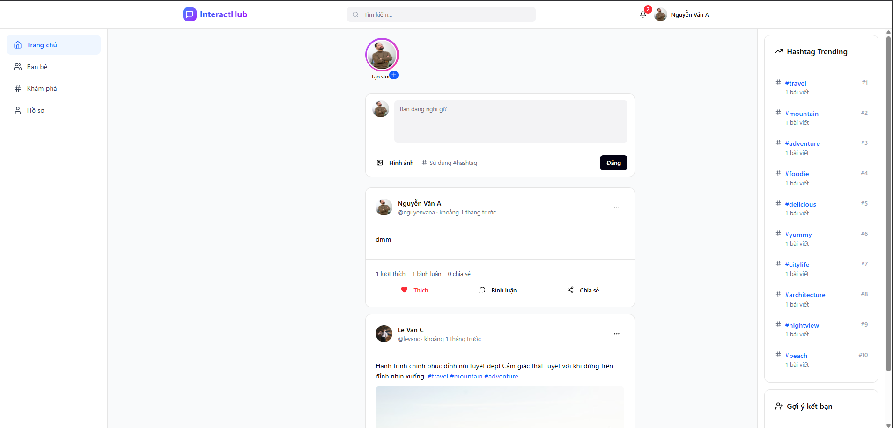
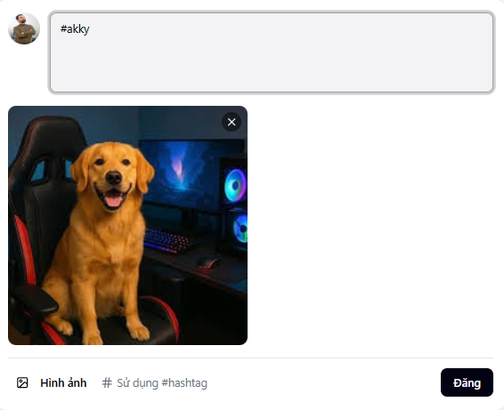
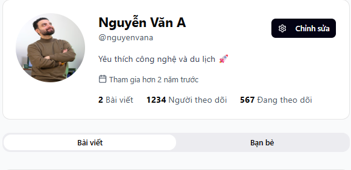

# 🚀 InteractHub – Social Media Web Application


A **full-stack social media web application** built with **React, TypeScript, ASP.NET Core, and SQL Server**.
This project demonstrates modern web development practices including **RESTful API design, authentication, real-time communication, testing, and cloud deployment**.

---

# 📸 Preview

## Homepage



## Post Feed



## Profile Page



---

# ✨ Features

## 👤 Authentication

* User registration
* Secure login with JWT
* Role-based authorization
* Protected routes

## 📝 Social Media

* Create posts with text and images
* Like and comment on posts
* Share posts
* Create temporary stories

## 👥 Social Interaction

* Send and accept friend requests
* Manage friends list
* View user profiles

## 🔔 Notifications

* Real-time notifications using SignalR
* Friend request alerts
* Interaction updates

## 🔍 Discover

* Search users and posts
* Trending hashtags
* Content reporting and moderation

---

# 🧰 Tech Stack

## Frontend

| Technology      | Description        |
| --------------- | ------------------ |
| React           | Frontend framework |
| TypeScript      | Static typing      |
| Tailwind CSS    | Modern UI styling  |
| React Router    | SPA routing        |
| Axios           | API communication  |
| React Hook Form | Form validation    |

---

## Backend

| Technology            | Description             |
| --------------------- | ----------------------- |
| ASP.NET Core          | Web API framework       |
| Entity Framework Core | ORM for database        |
| SQL Server            | Relational database     |
| ASP.NET Identity      | Authentication system   |
| JWT                   | Secure authentication   |
| SignalR               | Real-time notifications |
| Swagger               | API documentation       |

---

## Cloud & DevOps

| Technology         | Purpose          |
| ------------------ | ---------------- |
| Microsoft Azure    | Cloud hosting    |
| Azure App Service  | Web hosting      |
| Azure SQL          | Database         |
| Azure Blob Storage | Image storage    |
| GitHub Actions     | CI/CD automation |

---

# 🏗 System Architecture

```
React + TypeScript (Frontend SPA)
           │
           │ REST API
           ▼
ASP.NET Core Web API
           │
           ▼
Entity Framework Core
           │
           ▼
SQL Server Database
```

Real-time communication is implemented using **SignalR**.

---

# 📂 Project Structure

```
InteractHub
│
├── frontend
│   ├── components
│   ├── pages
│   ├── hooks
│   ├── services
│   ├── context
│   └── utils
│
├── backend
│   ├── Controllers
│   ├── Services
│   ├── Interfaces
│   ├── DTOs
│   ├── Models
│   ├── Data
│   └── Migrations
│
├── tests
│   └── UnitTests
│
└── README.md
```

---

# 🗄 Database Design

Main entities in the system:

* User
* Post
* Comment
* Like
* Friendship
* Story
* Notification
* Hashtag
* PostReport

Relationships include:

* One-to-Many (User → Posts)
* One-to-Many (Post → Comments)
* Many-to-Many (Users ↔ Friends)

---

# 🔗 API Endpoints

Example REST APIs:

```
POST /api/auth/register
POST /api/auth/login
GET  /api/posts
POST /api/posts
POST /api/posts/{id}/like
GET  /api/users/{id}
.........
```

API documentation is available at:

```
/swagger
```

---

# 🔐 Authentication

Authentication is implemented using **JWT (JSON Web Tokens)**.

Features:

* Secure login system
* Token-based authentication
* Role-based authorization
* Protected API endpoints

Roles:

* User
* Admin

---

# 🧪 Testing

Testing is implemented using:

* xUnit / NUnit
* Moq for dependency mocking

Tests include:

* Authentication services
* Post management services
* Friend request services

Minimum test coverage: **60%**

---

# ☁ Deployment

The application is deployed on **Microsoft Azure**.

Deployment includes:

* Azure App Service
* Azure SQL Database
* Azure Blob Storage
* CI/CD pipeline using GitHub Actions

Live Demo:

```
https://interacthub.azurewebsites.net
```

---

# ⚙ Installation

## Clone Repository

```
git clone https://github.com/tuanPeo27/InteractHub_SocialMedia.git
```

---

## Backend Setup

```
cd backend
dotnet restore
dotnet ef database update
dotnet run
```

Backend runs at:

```
http://localhost:5000
```

---

## Frontend Setup

```
cd frontend
npm install
npm run dev
```

Frontend runs at:

```
http://localhost:5173
```

---

# 📚 Learning Outcomes

Through this project, the following skills were developed:

* Full-stack web development
* RESTful API design
* Database modeling
* Authentication and authorization
* Cloud deployment
* CI/CD pipelines
* Unit testing

---

# 👨‍💻 Author

Student: **Your Name**
Course: **C# and .NET Development**
University: **Saigon University**

---

# ⭐ Support

If you like this project, please give it a **star ⭐ on GitHub**.
